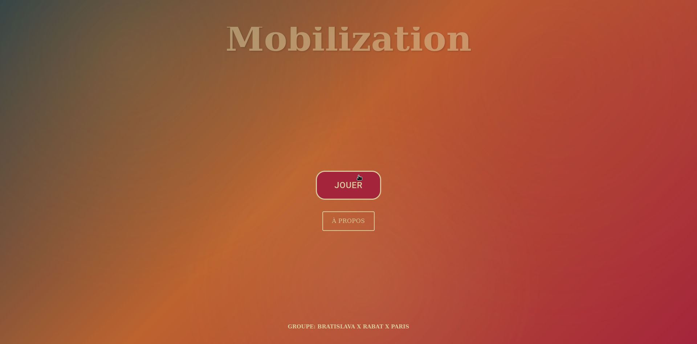
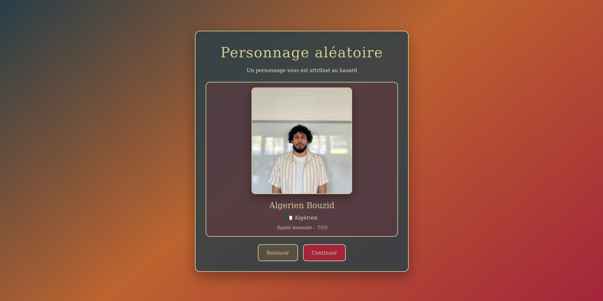
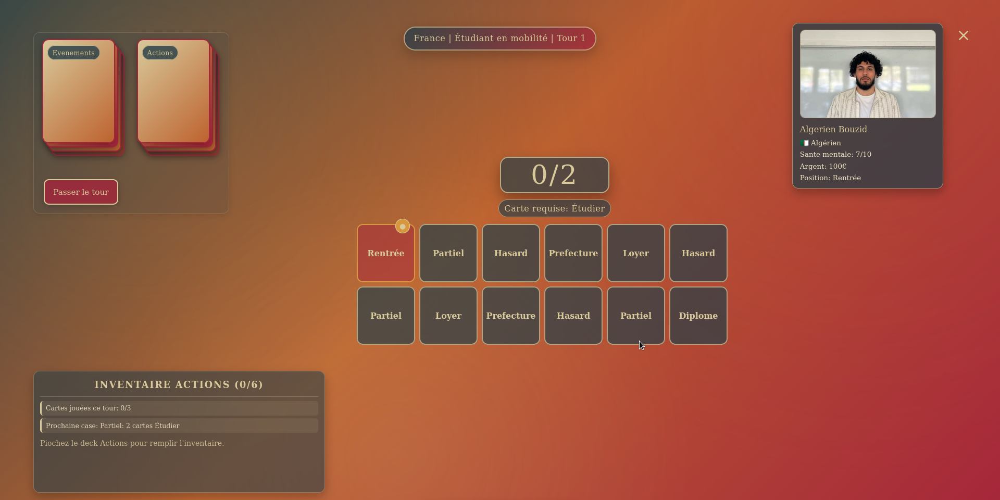

# MOBILIZATION

> *Un jeu de plateau pédagogique sur la vie étudiante, la mobilité internationale et la santé.*

---

**Groupe :** BRATISLAVA × RABAT × PARIS  
**Membres :** Ferencz ROUDET · Omar Farouk LASFAR · Sacha EHRMANNOS · Aymeric FENARD  
**Évaluations T4 :** [lien 1](#) · [lien 2](#)

---

## 🎯 Présentation du projet

**Mobilization** est un serious game éducatif multijoueur qui simule une année universitaire pour sensibiliser aux défis des étudiants — en mobilité internationale ou dans leur pays d'origine. En fonction du **personnage choisi** et du **mode de jeu**, les contraintes varient considérablement : administratives, financières, culturelles. L'objectif : faire comprendre par l'expérience que tous les étudiants ne partent pas avec les mêmes chances.

---

## 🖼️ Captures d'écran

  <table>
    <tr>
      <td align="center"> Menu principal</td>
      <td align="center"> Choix du personnage</td>
      <td align="center"> Écran principal</td>
    </tr>
  </table>

---

## ⚙️ Jouer au jeu

https://mobilization.netlify.app/

---

## 📋 Cahier des charges

---

### 🧠 Objectifs pédagogiques

**1. Comprendre les inégalités "pratiques" selon le contexte géographique**  
Les joueurs découvrent concrètement que les contraintes rencontrées par un étudiant (logement, visa, budget) varient considérablement selon qu'il étudie dans son pays d'origine ou à l'étranger.

**2. Prendre conscience du poids des choix et des ressources disponibles**  
Le joueur apprend à prioriser ses actions (travailler, étudier, payer son loyer) avec des ressources limitées, simulant la réalité de la gestion de vie étudiante.  

**3. Développer une intelligence émotionnelle et une empathie interculturelle**  
En incarnant des personnages issus de contextes différents (Bratislava, Rabat, Paris) et en vivant leurs contraintes spécifiques, les joueurs construisent une représentation concrète et empathique des réalités de leurs pairs internationaux.

---

### 🧠+ Objectifs pédagogiques avancés

**4. Comprendre les inégalités sociales**  
Nous n'avons pas eu le temps d'implémenter de mécaniques pour expliquer les difficultés d'intégration sociale que peuvent vivre les étudiants étrangers (en mobilité notamment). Cela pourrait être une piste intéressante pour le T3.  
Suggestion : Implémenter une mécanique "d'amis" qui compte le nombre d'amis de l'étudiant et qui influe sur sa santé mentale.

---

### 📚 Références

- Études sur la santé mentale des étudiants en mobilité — *Erasmus+ Impact Studies*
- Rapports OVE (Observatoire de la Vie Étudiante) sur les conditions de vie étudiante
- Charte NAFSA sur l'accompagnement des étudiants internationaux
- Serious games de référence : *Spent* (urban poverty), *Papers Please* (bureaucratie et frontières)

---

## Description des fonctionnalités

---

### 🔄 Simulation

Le jeu simule une année universitaire découpée en tours. À chaque tour, le joueur avance case par case sur le plateau, gère ses ressources et fait face à des événements aléatoires. L'objectif est d'atteindre la dernière case — le **Diplôme** — avec une santé mentale supérieure à 0.

#### 🗺️ Les deux plateaux

| | 🏠 Plateau Natif | ✈️ Plateau Mobilité |
|---|---|---|
| **Cases** | 8 cases | 12 cases |
| **Parcours** | Rentrée → Partiel → Hasard → Loyer → Hasard → Partiel → Loyer → Diplôme | Rentrée → Partiel → Hasard → Préfecture → Loyer → Hasard → Partiel → Loyer → Préfecture → Hasard → Partiel → Diplôme |
| **Contraintes admin.** | Absentes | Élevées (visa, préfecture…) |
| **Réseau social** | Fort | Faible ou inexistant |
| **Difficulté** | Modérée | Élevée |

Le niveau de difficulté est déterminé par la combinaison **personnage × plateau**.

---

### 🎮 Actions du joueur

À chaque tour, dans l'ordre :

1. **Piocher une carte Événement** (obligatoire sur les cases Hasard) → appliquer ses effets immédiatement
2. **Jouer jusqu'à 3 cartes Action** de son inventaire pour satisfaire l'exigence de la case
3. **Valider la case** si les conditions sont remplies, sinon subir une pénalité
4. **Mettre à jour les ressources** (santé mentale, argent)
5. **Passer au tour suivant**

---

### 👥 Personnages jouables

#### 🏠 Mode Natif (étudiants français)

| Personnage | Revenu | Santé mentale de départ |
|---|---|---|
| **Kadir** 🇫🇷 | Moyen | 8/10 |
| **Momo** 🇫🇷 | Faible | 6/10 |
| **Raphus** 🇫🇷 | Élevé | 9/10 |

#### ✈️ Mode Mobilité (étudiants internationaux)

| Personnage | Origine | Revenu | Santé mentale de départ |
|---|---|---|---|
| **Ofmaroki** 🇲🇦 | Marocain | Faible | 7/10 |
| **Algerien** 🇩🇿 | Algérien | Moyen | 8/10 |
| **Emre** 🇹🇷 | Turc | Moyen | 7/10 |
| **Kadir** 🇹🇷 | Turc | Faible | 6/10 |
| **Ofmaroki (int.)** 🇲🇦 | Marocain | Élevé | 8/10 |
| **Aemerik** 🇺🇸 | Américain | Élevé | 9/10 |
| **Djason** 🇭🇹 | Haïtien | Faible | 5/10 |

---

### 🃏 Cartes du jeu

#### Cartes Action *(inventaire du joueur, max 6 cartes)*

| Carte | Effet | Usage |
|---|---|---|
| **Étudier** | Valide les cases Partiel et Loyer | — |
| **Travailler** | Valide les cases Préfecture (mode Mobilité) | — |
| **Se reposer** | +1 santé mentale | — |
| **Appeler la famille** | +1 santé mentale | — |
| **Consulter un médecin** | +1 santé mentale | −20 € |
| **Sortie bar** | +1 santé mentale | — |
| **Gérer l'administratif** | Valide plusieurs types de cases | −Énergie, −Temps |
| **Demander de l'aide** | Bonus contextuel | Réseau local requis |

---

#### Cartes Événement *(pioche aléatoire sur les cases Hasard — 13 cartes)*

**Événements simples :**
- Contrôle de visa — problèmes administratifs
- Maladie — −2 santé mentale, perte d'une semaine
- Loyer à payer — payer ou passer son tour

**Événements avec choix :**

| Événement | Options disponibles |
|---|---|
| Retard de bourse | Emprunter à la famille / Travail illégal / Attendre |
| Soirée tourne mal | Café / Rester chez soi / Appeler un ami |
| Absence injustifiée | Faux certificat / Parler à l'admin / Subir la sanction |
| Avis de décès | Retour en famille / Continuer les études / Consulter un thérapeute |
| Bourse obtenue | Célébrer / Économiser / Aider la famille |
| Opportunité d'emploi | Accepter / Refuser / Négocier |

---

#### Cases du plateau *(exigences)*

| Case | Carte requise |
|---|---|
| Partiel | Étudier |
| Loyer | Étudier ou ressource argent |
| Préfecture / Ambassade | Travailler ou Gérer l'administratif |
| Hasard | Piocher une carte Événement (obligatoire) |
| Diplôme | Atteindre la case avec santé mentale > 0 |

---

### 🎬 Scénarios

#### Scénario 1 — L'étudiant local sans contraintes majeures

> **Raphus**, plateau Natif. Revenu élevé, santé mentale à 9/10. Il traverse le plateau sans cases de Préfecture. Les événements négatifs restent gérables grâce à ses ressources. **Difficulté ressentie : faible.**

---

#### Scénario 2 — L'étudiant en mobilité avec ressources limitées

> **Djason**, plateau Mobilité. Revenu faible, santé mentale à 5/10 dès le départ. Il pioche *Retard de bourse* → doit choisir entre emprunter ou travailler illégalement. La case Préfecture arrive avant qu'il ait pu reconstituer ses cartes Action. **Difficulté ressentie : très élevée.**

---

#### Scénario 3 — Effet boule de neige — Burn-out

> **Emre** enchaîne *Maladie* (−2 santé mentale) + *Absence injustifiée* (pénalité académique) + *Loyer à payer* sans ressource argent suffisante. Sa santé mentale atteint 0 → **défaite**, avec message contextuel illustrant l'effet cumulatif des difficultés en mobilité.

---

### 🏆 Conditions de fin de partie

**Victoire** : Atteindre la dernière case (Diplôme) avec santé mentale > 0. Un écran de statistiques affiche les tours joués, la santé finale, l'argent restant et les cartes jouées.

**Défaite** : Santé mentale à 0 à n'importe quel moment du parcours, avec un message contextuel selon le personnage et les événements traversés.

---

## 🚧 Contraintes de développement

- Session de **45 à 90 minutes**
- Interface jouable sans explication préalable
- **8 personnages** jouables × **2 modes** = 16 expériences distinctes
- Chaque carte Événement impacte **au moins une ressource**
- Le plateau Mobilité contient **+30 % de cases administratives** vs le plateau Natif
- Inventaire limité à **6 cartes Action** maximum
- Éléments visuels **inclusifs et non stéréotypés**

---

## 🚀 Fonctionnalités avancées

**Système de santé mentale évolutif**  
Une jauge indépendante réagit différemment selon le personnage et le plateau. Sur le plateau Mobilité, l'isolement et les événements administratifs la consomment plus vite. Certains personnages (Djason, Momo) démarrent avec une jauge déjà basse, rendant chaque décision critique.

**Événements à choix multiples**  
Plusieurs cartes Événement proposent 2 à 3 options avec des conséquences différentes (financières, académiques, sur la santé mentale), simulant la complexité des arbitrages réels de la vie étudiante.

**Mode asymétrique**  
Chaque personnage dispose d'attributs de départ distincts (revenu, santé mentale initiale) qui influent directement sur la difficulté perçue et les stratégies disponibles.

**Débriefing intégré**  
À la fin de la partie, un écran de statistiques récapitule le parcours du joueur — support de discussion pédagogique pour un enseignant ou formateur.

**Architecture technique**  
TypeScript strict, composants modulaires (React), hooks personnalisés pour la gestion des decks et des états. 20 tests unitaires couvrant la logique de jeu, la détection de situations bloquées et la validation des mécaniques de progression.

---

*Mobilization · T4 · Bratislava × Rabat × Paris · 2025–2026*